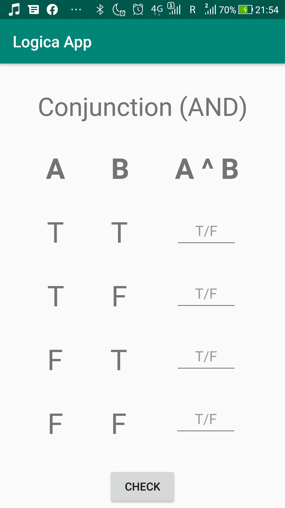

# Level 1 Learning Task 2 - Logica app
This is the second task in the first level.
## What's inside
Thi is the app in which the knowledge of the user for the truth table of conjunction is tested. It is a quiz in which the user is only allowed to fill in “T” or “F” (true or false). When all input fields are filled in, the user can click on the submit button to see how many answers are correct. This is done with a Toast message. The layout file is built with a constraint layout.
## How is the T/F limitation implemented
In order to limit the user input in EditTexts only to "T" or "F" I had to set 2 properties for each of them:
* <i>digits</i> to <b>FT</b> - this makes only Fs and Ts available to input
* <i>maxLength</i> to <b>1</b> - this limits the maximum length of the input to 1
## Screenshots
    
    
